# 基于springboot+vue前后端分离的在线考试管理系统带万字论文

## 一、介绍

技术介绍：
架构: B/S、MVC
技术栈：Java、Mysql、SpringBoot、Mybatis-Plus、Vue

项目介绍：
①：登录模块：用户登录

②：管理员角色：
考试管理：考试查询、添加考试
题库管理：所有题库，添加题库、题库组卷
成绩查询：学生成绩查询，成绩分段查询
学生管理：学生查询，添加学生
教学管理：教师查询，添加教师

③：学生角色：
考试中心：搜索试卷，开始考试
试卷练习：模拟考试
我的分数：考试分数展示
交流区：留言，评论

④：教师角色：
考试管理：考试查询、添加考试
题库管理：所有题库，添加题库
成绩查询：学生成绩查询，成绩分段

### 完整项目获取

通过网盘分享的文件：考试管理系统

链接: https://pan.baidu.com/s/1S3CJKdzjW3dyLuHtsGJarg?pwd=6cgy 提取码: 6cgy
--来自百度网盘超级会员v3的分享

通过网盘分享的文件：工具包

链接: https://pan.baidu.com/s/1YmdoJvkjoUjA75wvHLDZ6A?pwd=xm96 提取码: xm96
--来自百度网盘超级会员v3的分享

需要远程项目部署或项目修改和毕业设计也可联系（添加申请时请备注好来意）

通过网盘分享的文件：远程调试部署联系方式

链接: https://pan.baidu.com/s/1W0dDcoZmayG0c7USJDYBYg?pwd=nqd7 提取码: nqd7
--来自百度网盘超级会员v3的分享

### 项目合集(项目不断更新中)
链接: https://pan.baidu.com/s/1nY-zhvAK0CXYcn3g7LzQnQ?pwd=id3c 提取码: id3c
--来自百度网盘超级会员v3的分享

#### 这些项目一起发你了 可以分享给你需要的同学 调试可找我 也接二次修改和项目定制、毕业设计等

## 接毕业设计和论文

微信联系方式：xzxj0206  QQ：3808981644   (支持修改、 部署调试、 支持代做毕设)

接网站建设、小程序、H5、APP、各种系统等，单片机、嵌入式也可以做

选题+开题报告+任务书+程序定制+安装调试+论文+答辩ppt  都可以做

## 二、万字论文

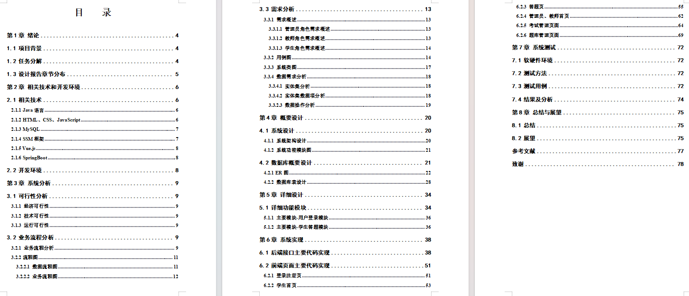

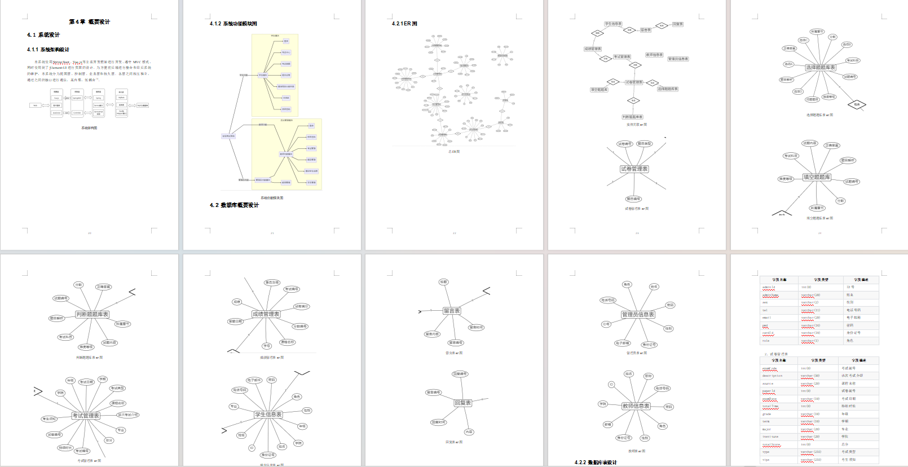

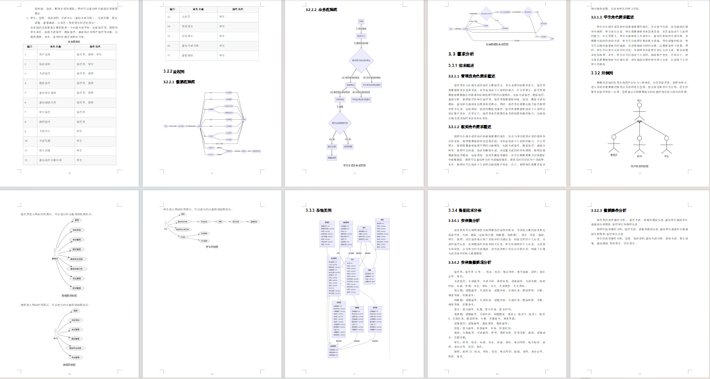

## 三、部分页面截图展示

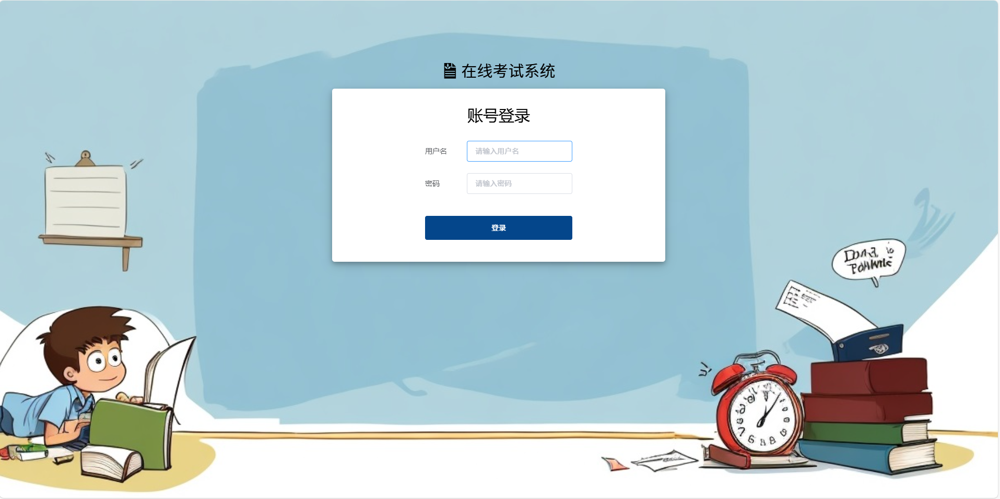

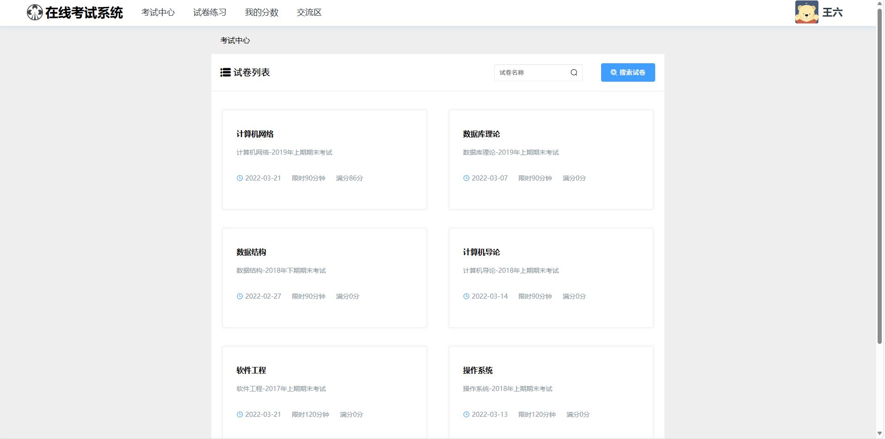

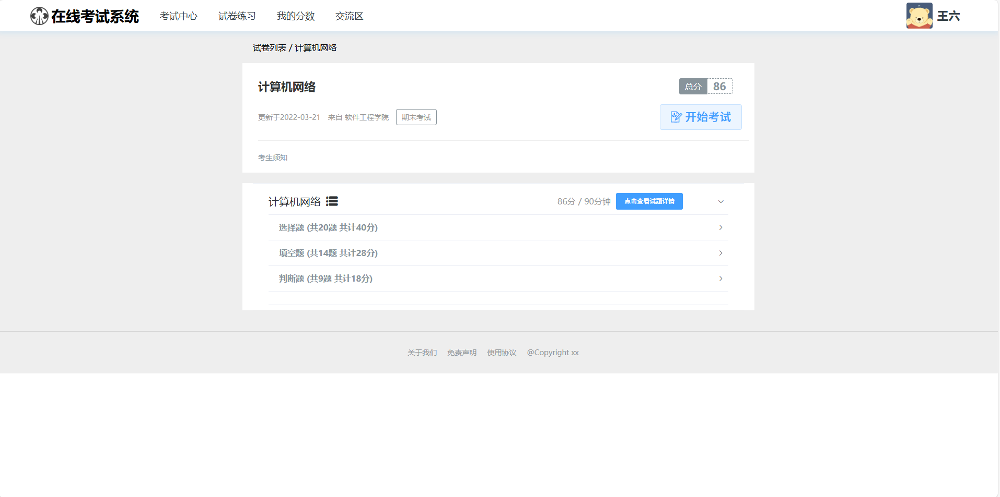

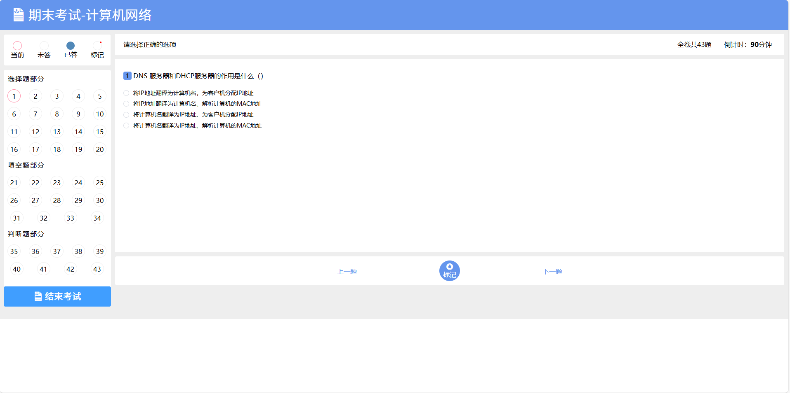

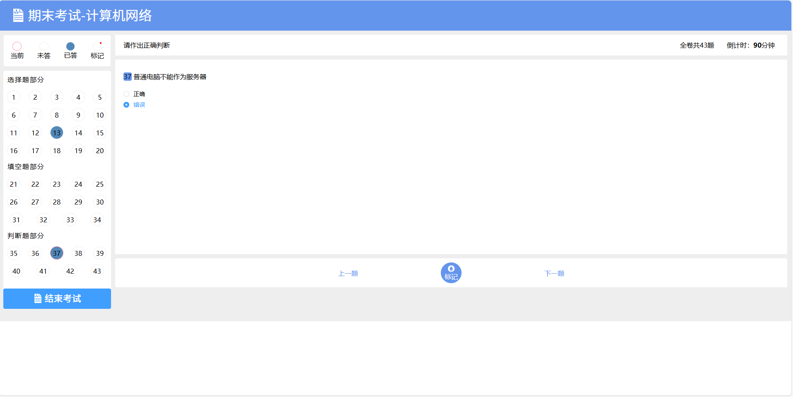

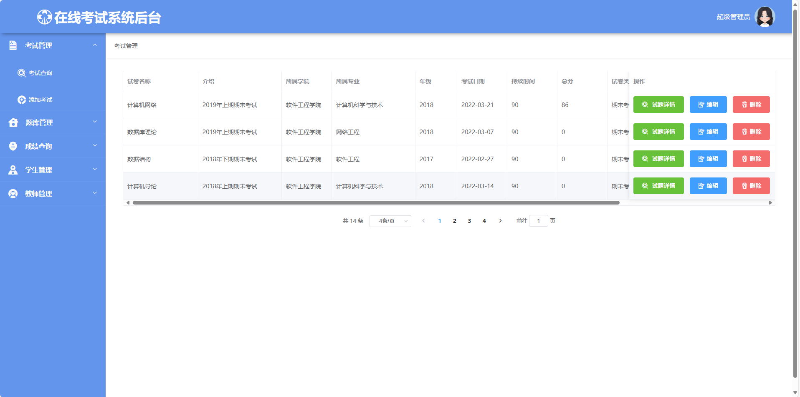

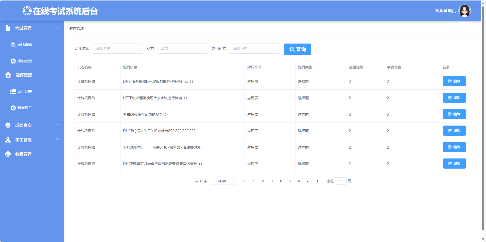

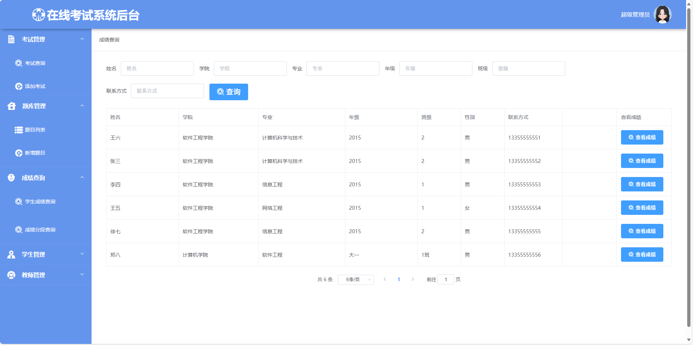